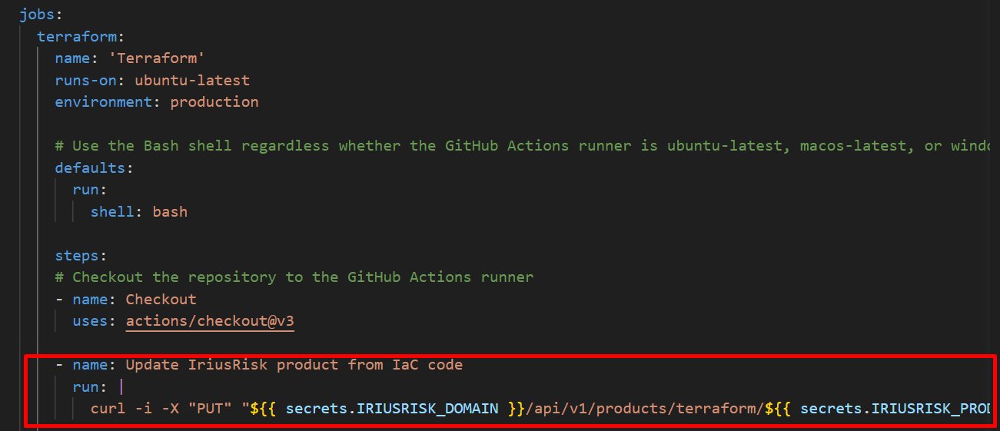

# Introduction
**Terraform** is an open-source infrastructure as code software tool created by HashiCorp. Terraform enables you to create, maintain and improve infrastructure reliably and predictably on major infrastructure cloud providers (e.g. AWS, GCP, Azure, OpenStack, CloudStack).

IriusRisk allow in their API upload the terraform file to automatically create a new threat model in IriusRisk for this IaC architecture. They explain how to upload it with Postman, but with this document you can add a synchronization of the architecture to IriusRisk in your pipeline.

---
# Integration

In the *YML* file that is used by github actions pipeline of your project, We have to add the following lines as a step:

```yml
- name: Update IriusRisk product from IaC code
      run: |
        curl -i -X "PUT" "${{ secrets.IRIUSRISK_DOMAIN }}/api/v1/products/terraform/${{ secrets.IRIUSRISK_PRODUCT_ID }}" -H "accept: application/json" -H "api-token: ${{ secrets.API_TOKEN_IRIUSRISK }}" -H "Content-Type: multipart/form-data" -F "tf-file=@${{ secrets.TF_FILE }}"
      
```



With this step, when the pipeline is executed, the IriusRisk product will be updated with the IaC. But before, We have to configurate and add the variables needed.

## Configuration
We have to manage the access to the API to allow the pipeline. First of all, in the settings of IriusRisk, the API must be enabled.


Once enabled, logout and log back in again. Then, in the Users tab, the user who will access the API must be selected, doing so by clicking on the "Generate API token" button:


Then, We have to define the following variables for the pipeline:

- **IRIUSRISK_DOMAIN**: The URL of the domain that you are using of IriusRisk. For example: *https://iriusrisk.example.com*
- **API_TOKEN_IRIUSRISK**: The generated API token
- **IRIUSRISK_PRODUCT_ID**: The product id (the product must be created before this)
- **TF_FILE**: The path of the terrafom file. For example: main.tf

To add this variables We have to navigate to the settings tab of your project, and select *Secrets and variables* -> *Actions*. Then click on  *New repository secret*.


# References

- https://www.iriusrisk.com/resources-blog/threat-modeling-workflow-for-terraform-defined-architectures-using-iriusrisk
